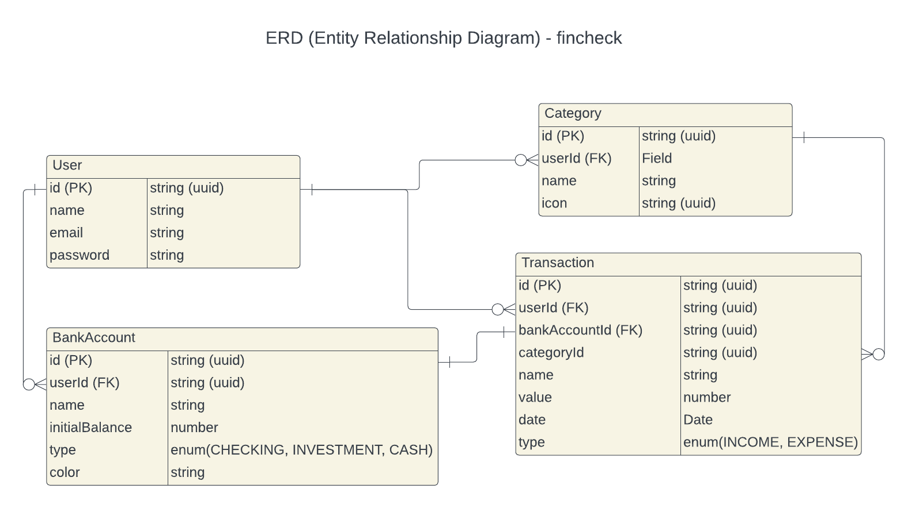

# fincheck - api

## ERD (Entity Relatioship Diagram)



## Description

fincheck is a project to manage your income and expenses with focus on usability.

## Project setup

```bash
$ yarn install
```

## Compile and run the project

```bash
# development
$ yarn run start

# watch mode
$ yarn run start:dev

# production mode
$ yarn run start:prod
```

## Run tests

```bash
# unit tests
$ yarn run test

# e2e tests
$ yarn run test:e2e

# test coverage
$ yarn run test:cov
```
